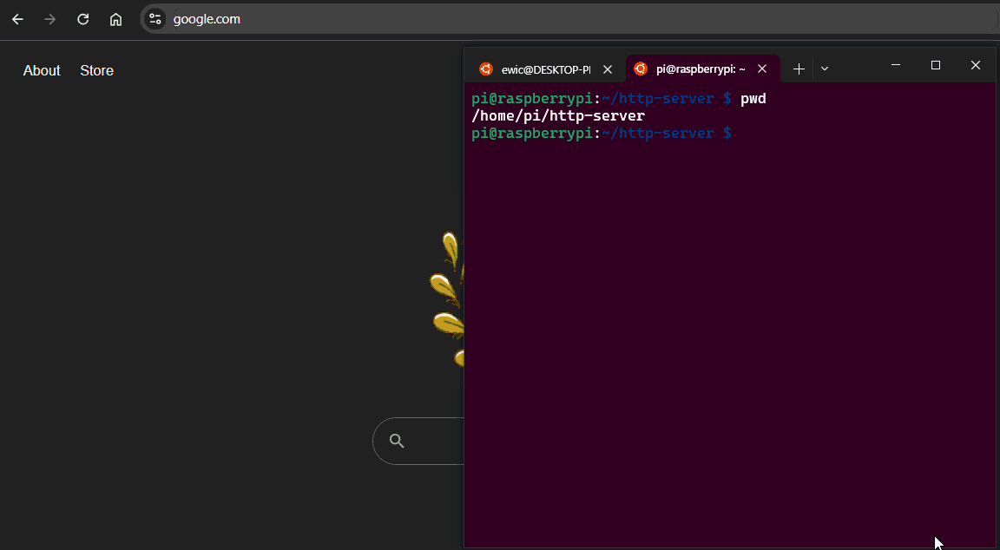

# http-server

## Example GET Request




## Setup Raspberry Pi To Be HTTP-Server

#### Confirm the Pi is up-to-date
```bash
sudo apt update
sudo apt upgrade
sudo apt install gcc
sudo apt install build-essential
```
- scp the project files to the pi

#### Copy project over to Pi
```bash
ssh pi@192.168.1.225 "mkdir -p /home/pi/http-server"
scp -r src/ Makefile  pi@192.168.1.225:/home/pi/http-server/
```
- Ensure these commands are being done in the **root** of this git repo/directory
- Create a _http-server_ directory on the Pi in case one does not exist yet
- SCP over only the relevant files from the repo
    - That is the `Makefile` and the `src/` dir

#### Build project on the Pi
```bash
pi@raspberrypi:~/http-server $ make
```
- SSH into the Pi and run make within the root of the http-server directory

#### Run the HTTP server!
```bash
pi@raspberrypi:~/http-server $ ./server
Server is up and available through:
lo - 127.0.0.1:2000
wlan0 - 192.168.1.225:2000
Server ready to service client msgs.
```

https://jmp.sh/Wqce2nsi