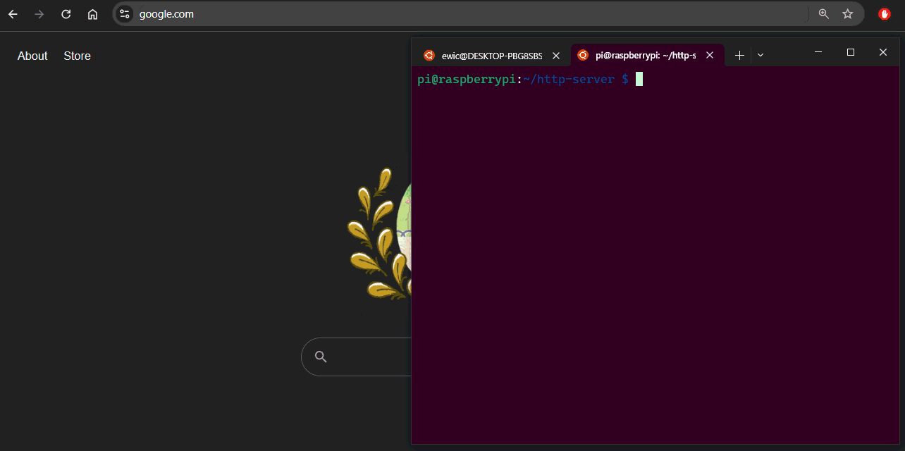
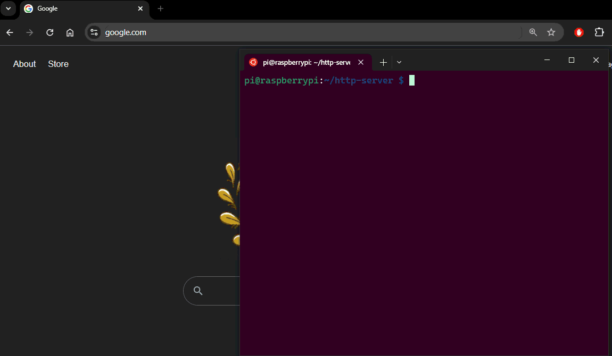

# http-server

#### A multiplexing http webserver capable of running on a Raspberry Pi. Built in C.

The webserver stores "notes" that are displayed in a basic HTML table.

Notes can be retrieved through GET or added with POST

## Example GET Request


- When the server is running, the browser can be used to query the list of notes in the database
- The notes can also be filtered with query params in the URL such as `to`, `from` and `id`

## Example POST Request


- The database of notes can be added to by POSTing the data
    - The data requires the `to`, `from`, and `note` strings
- The data **cannot** be passed in the POST as query parameters
- Example CURL POST request:
```bash
curl -X POST http://192.168.1.225:2000/ -d "to=Ryan" -d "from=Eric" -d "note=Go to Costco to join the membership"
```

## Example Hosting Multiple Clients

- The HTTP webserver is capable of serving multiple clients at once
- The database results can be filtered with query params!

## Notes
```c
typedef struct inote{
    char to[32];
    char from[32];
    char note[256];
    unsigned int id;
} inote_t; 
```
- The notes are basic structs containig the elements as shown above

## Setup Raspberry Pi To Be HTTP-Server

#### Confirm the Pi is up-to-date
```bash
sudo apt update
sudo apt upgrade
sudo apt install gcc
sudo apt install build-essential
```
- scp the project files to the pi

#### Copy project over to Pi
```bash
ssh pi@192.168.1.225 "mkdir -p /home/pi/http-server"
scp -r src/ Makefile  pi@192.168.1.225:/home/pi/http-server/
```
- Ensure these commands are being done in the **root** of this git repo/directory
- Create a _http-server_ directory on the Pi in case one does not exist yet
- SCP over only the relevant files from the repo
    - That is the `Makefile` and the `src/` dir

#### Build project on the Pi
```bash
pi@raspberrypi:~/http-server $ make
```
- SSH into the Pi and run make within the root of the http-server directory

#### Run the HTTP server!
```bash
pi@raspberrypi:~/http-server $ ./server
Server is up and available through:
lo - 127.0.0.1:2000
wlan0 - 192.168.1.225:2000
Server ready to service client msgs.
```
